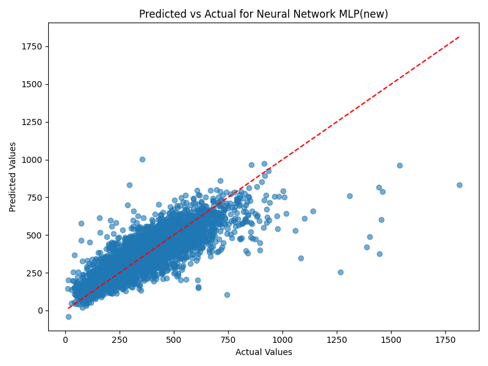

# Investigating the Relationship between Demographic Factors and Heart Disease Mortality

# Goal of the Project

This analysis investigates the relationship between demographic characteristics—specifically income, ethnicity, and gender to predict heart disease mortality rates at the county level using the data in 2020. Understanding these relationships can guide targeted public health interventions aimed at reducing heart disease-related mortality.

# Data Sources

### Primary Data Sources:
- **U.S. Census Bureau**
  - Link: [census.gov](https://www.census.gov/)
  - Provides detailed demographic data (income, ethnicity, gender) by county.

- **Heart Motality Data**
  - Link: [U.S. Department of Health & Human Services-Heart Disease Mortality](https://catalog.data.gov/dataset/heart-disease-mortality-data-among-us-adults-35-by-state-territory-and-county-2019-2021)
  - Provides age-adjusted heart disease mortality rates at the county level.

### Data Collection Methods:
- Demographic data sourced from the U.S. Census Bureau, primarily using decennial census data supplemented by the American Community Survey (ACS).
- Heart disease mortality data sourced from U.S. Department of Health & Human Services-Heart Disease Mortality.

### Relevant Features:
- **Income:** categorial household income at the county level.
- **Ethnicity:** Proportions of different ethnic groups within each county.
- **Gender:** Gender composition, split rows into genders to determine which gender shows higher mortality.
- **Heart Disease Mortality Rate:** Age-adjusted heart disease mortality per 100,000 population.

### Data Limitations:
- Data aggregation at the county level obscures finer-scale (e.g., neighborhood-level) variations.
- Census data relies on self-reporting, potentially introducing reporting biases.
- Income data does not account for income inequality or detailed economic disparities within counties.
- Missing mortality data in sparsely populated counties due to confidentiality restrictions.

### Data Reproduction
- install the additional package: pip install -r `requirements.txt`
- run `preprocess.ipynb` file for all pre-processing data to convert the data to be ready for building models.
- run `pred.ipynb` file for obtaining the best prediction model among all prediction results which are individually tuned.

# Modeling Approaches
### Data Preprocessing
Using `preprocess.ipynb`
- Extracted only the necessary columns from the dataset and removed rows with missing values.
- Merged the dataset with regional income distribution data to complete the dataset.
- Applied one-hot encoding to categorical variables.
- Scaled the remaining numerical features using a standard scaler for normalization.

### Individual Models Explored

- **Linear Regression:** Using `ols.ipynb` to serves as a baseline, assuming a linear relationship between features and the target variable.  
- **Decision Tree Regression:** Based on `decision.ipynb` to captures non-linear patterns by recursively splitting the data based on feature values.  
- **KNN Regressor:** Using `knn.ipynb` to determine the optimal number of neighbors for regression.
- **Random Forest Regression:** It enhances robustness by averaging multiple decision trees, reducing overfitting, and capturing complex feature interactions. The optimal hyperparameters are tuned using the results from `randomforest_best_hyperparameters.ipynb`. Then, `optimal_randomforest_model.ipynb` is used to obtain RMSE and R-squared for the random forest model.
- **Stochastic Gradient Descent (SGD):** Efficiently optimizes models for large datasets (20,000+ rows) by updating weights incrementally.  
- **Support Vector Regression (SVR):** Leverages kernel tricks to model non-linear relationships while remaining resilient to outliers, making it effective for limited data scenarios.  
- **Neural Network (MLP):** Learns complex, high-dimensional patterns using multiple layers and activation functions, making it suitable for deep feature extraction.  

### Evaluation Metrics:
- Root Mean Squared Error (RMSE)
- R-squared (R²)

# **Model Evaluation and Results**
## Results

| Model                      | RMSE (lower is better) | R² (higher is better) |
|-----------------------------|-------------------------|-------------------------------|
| Linear Regression             | 95.99        | 0.6330 |
| KNN Regression             | 124.96        | 0.3781 |
| Decision Tree Regression     | 116.89      | 0.4558           |
| Random Forest                | 99.53        | 0.6054             |
| SGD Regression               | 95.89                | 0.6338                       |
| SVR                          | 123.27            | 0.3948           |
| Neural Network (MLP)         | **84.81**    | **0.7135**           |

---
## Model Performance Comparison
The following bar plots illustrate the performance of different models based on **R² Score**, **RMSE**, and **MAE**.

- **R² Score**: Higher is better, indicating a better fit to the data.
- **RMSE (Root Mean Squared Error)**: Lower is better, measuring prediction error magnitude.
- **MAE (Mean Absolute Error)**: Lower is better, representing the average absolute error in predictions.

---

## **Feature Importance Analysis**
Feature importance was analyzed for **Linear Regression**, **SGD**, and **Random Forest Regression** to understand which features contributed the most to the model predictions.

### **Linear Regression**

### **SGD Regression**
.png)

### **Random Forest Regression**

---

### **Predicted vs Actual Values**
The scatter plot below compares the predicted values against the actual heart disease mortality rates for the best-performing model (**Neural Network**).

- The closer the points are to the red dashed line, the better the model's predictions align with actual values.

### Interpretation
The neural network (MLP) produced the most accurate predictions, followed by SGD and Linear Regression. This suggests that the strong performance of linear models indicates a direct correlation between income and mortality, reinforcing income as a key predictor of heart disease mortality rates.

# Futher Research

### Recommended Model:
- **Neural Network** is recommended due to the best overall balance between predictive accuracy (lowest RMSE and high R² score) and interpretability, making it suitable for practical application in public health policy formulation.

### Recommendations for Future Analysis:
- Integrate additional demographic and socioeconomic data (e.g., education levels, employment status, healthcare access).
- Perform analysis at finer resolutions (e.g., zip code level) to refine public health targeting and interventions.

